## Installation

### 安装docker

若本地尚未安装docker：

```bash
cd S2R_ws/SIM2REAL-2025/scripts
bash docker_install.sh
```

验证docker安装：

```bash
docker --version
```

安装参考链接，[docker install](https://docs.docker.com/engine/install/ubuntu/)。

### 安装nvidia driver

推荐使用Software & Updates中Additional Drivers安装，创建镜像和容器前需要检查宿主机的显卡驱动是否正常。

打开终端，输入nvidia-smi检查驱动是否安装成功。

安装 nvidia-docker2

```bash
sudo systemctl --now enable docker

distribution=$(. /etc/os-release;echo $ID$VERSION_ID) \
   && curl -s -L https://nvidia.github.io/nvidia-docker/gpgkey | sudo apt-key add - \
   && curl -s -L https://nvidia.github.io/nvidia-docker/$distribution/nvidia-docker.list | sudo tee /etc/apt/sources.list.d/nvidia-docker.list
   
sudo apt-get update
sudo apt-get install -y nvidia-docker2
sudo systemctl restart docker
```

### 注册 dockerhub

注册dockerhub账号：[dockerhub](https://hub.docker.com/)

登录dockerhub账号

```bash
docker login
```

### Build server

我们提供了两种方案供选手在本地运行仿真环境。

环境依赖：

+   ubuntu >= 20.04
+   cuda >= 11.8
+   显存 >= 6GB
+   空余硬盘空间 >= 80G

#### 从docker hub拉取镜像

```bash
docker pull discoverse/s2r2025_server:v1.0
```

#### 使用docker file 本地构建镜像

>   ❗️ 请严格按照步骤操作

Clone DISCOVERSE
```bash
mkdir S2R_ws && cd S2R_ws
git clone https://github.com/DISCOVER-Robotics/SIM2REAL-2025.git
git clone https://github.com/TATP-233/DISCOVERSE.git --recursive
cd DISCOVERSE && git checkout s2r2025
```

使用docker file构建docker image：

>   ❗️ <PATH-TO-S2R_ws> 要换成本地`S2R_ws`的绝对路径，例如`/home/xxx/ws/S2R_ws`

```bash
cd S2R_ws/SIM2REAL-2025/docker
docker build -f Dockerfile.server -t discoverse/s2r2025_server:v1.0 <PATH-TO-S2R_ws>
```

因为镜像文件较大，需等待较长时间，如果因为网络原因构建失败，请配置代理或者使用镜像加速器。

### Run server container

打开`scripts/create_container_server.sh`并修改镜像 和 tag名称

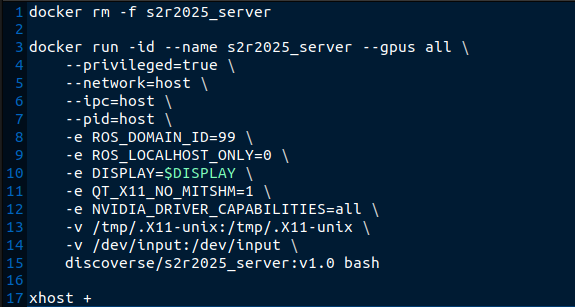

创建server container：

```bash
cd SIM2REAL-2025/scripts
bash create_container_server.sh
```

终端中进入server container：

```bash
cd SIM2REAL-2025/scripts
bash exec_server.sh
```

电脑重启后，需要重新启动容器

```bash
docker start s2r2025_server
```

❗️ 若后续比赛有内容更新，请进入容器中更新

```bash
cd SIM2REAL-2025/scripts && bash exec_server.sh
cd SIM2REAL-2025
git pull
```

启动比赛。进入server 容器的终端：

```bash
cd /workspace/SIM2REAL-2025/s2r2025
python3 s2r_server.py --round_id 1
# round_id 为 [1、2、3] 对应比赛的轮数
```

### Build client

和server一样，选手可以通过直接拉取远程镜像或使用docker file构建两种方式来在本地构建client docker镜像。

#### 从 docker hub 拉取镜像 

```bash
docker pull discoverse/
```

#### 从docker file本地构建镜像

>   ❗️ <YOUR-TEAM-NAME>:<TAG>要替换成参赛队伍名和TAG，例如 `team_A:v1`

```bash
cd S2R_ws/SIM2REAL-2025/docker
docker build -f Dockerfile.client -t <YOUR-TEAM-NAME>:<TAG> .
```

### Run client container

打开`create_container_client.sh`并修改镜像 和 tag名称

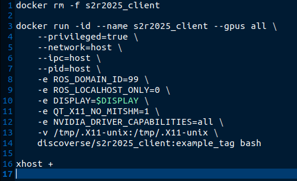

创建client container：

```bash
cd SIM2REAL-2025/scripts
bash create_container_client.sh
```

终端中进入client container：

```bash
cd SIM2REAL-2025/scripts
bash exec_client.sh
```

### Test ros2 communication

>   ❗️ <CLIENT_CONTAINER_ID>要替换成选手自己构建的client docker container的id，可用`docker ps -a`指令查询

```bash
# server --> client 通信测试
(new terminal)
docker exec -it s2r2025_server bash
ros2 topic pub /server_test std_msgs/msg/String "data: 'hello from server'"

(new terminal)
docker exec -it <CLIENT_CONTAINER_ID> bash
# 查看所有活动的topics
ros2 topic list
# 查看topic信息
ros2 topic info /server_test
# 测试订阅server发布的消息
ros2 topic echo /server_test

# client --> server 通信测试
(new terminal)
docker exec -it <CLIENT_CONTAINER_ID> bash
ros2 topic pub /client_test std_msgs/msg/String "data: 'hello from client'"

(new terminal)
docker exec -it s2r2025_server bash
# 测试订阅server发布的消息
ros2 topic echo /client_test
```

## 用手柄遥控MMK2

MMK2（Mobile Manipulation Kit 2）是本次比赛使用的机器人平台，MMK2是人形升降双臂机器人的名字，以下是使用手柄操作仿真环境里的MMK2的操作指南。

```bash
(new terminal) # 启动比赛
docker exec -it s2r2025_server bash
cd /workspace/SIM2REAL-2025/s2r2025
python3 s2r_server.py --round_id 1

(new terminal)
docker exec -it s2r2025_server bash
# 需要先连接手柄
# ls /dev/input/ | grep js
# 如果有js0则说明已经在container中识别到了手柄
ros2 run joy joy_node

(new terminal) 
docker exec -it s2r2025_server bash
cd /workspace/SIM2REAL-2025/s2r2025
# 如果是Logitech类手柄，将/workspace/SIM2REAL-2025/s2r2025/joy_control_test.py
# line 14 `NUM_BUTTON=12` 改成 `NUM_BUTTON=11`
python3 joy_control_test.py
```

手柄操作说明（以XBOX360为例）：

+   左摇杆：控制底盘移动
+   右摇杆：控制头部运动
+   LT左扳机：升降提高
+   RT右扳机：升降降低
+   LB左肩键 （持续按下 控制左侧机械臂）：
    +   方向键 上下：机械臂末端沿x轴平移
    +   方向键 左右：机械臂末端沿y轴平移
    +   左摇杆 上下：机械臂末端沿z轴平移
    +   左摇杆 左右：机械臂末端绕z轴旋转
    +   右摇杆 左右：机械臂末端绕x轴旋转
    +   右摇杆 上下：机械臂末端绕y轴旋转
    +   LT、RT：控制夹爪开合
+   RB左肩键 （持续按下 控制右侧机械臂）：
    +   操作逻辑同LB。LB、RB可同时按下

## 仿真环境说明

### ROS2 相关

#### Node Info

```yaml
/MMK2_mujoco_node
  Subscribers:
    /mmk2/cmd_vel: geometry_msgs/msg/Twist
    /mmk2/head_forward_position_controller/commands: std_msgs/msg/Float64MultiArray
    /mmk2/left_arm_forward_position_controller/commands: std_msgs/msg/Float64MultiArray
    /mmk2/right_arm_forward_position_controller/commands: std_msgs/msg/Float64MultiArray
    /mmk2/spine_forward_position_controller/commands: std_msgs/msg/Float64MultiArray
  Publishers:
    /mmk2/camera/head_camera/aligned_depth_to_color/image_raw: sensor_msgs/msg/Image
    /mmk2/camera/head_camera/color/image_raw: sensor_msgs/msg/Image
    /mmk2/camera/left_camera/color/image_raw: sensor_msgs/msg/Image
    /mmk2/camera/right_camera/color/image_raw: sensor_msgs/msg/Image
    /mmk2/joint_states: sensor_msgs/msg/JointState
```

#### Topic Info

所有相机的分辨率都是宽640*高480，状态量ros2 topic的发布频率均为24Hz。

```yaml
Published topics:
 * /clock [rosgraph_msgs/msg/Clock] 1 publisher
	# 仿真时钟
 * /mmk2/head_camera/aligned_depth_to_color/camera_info [sensor_msgs/msg/CameraInfo] 1 publisher
 	# mmk2机器人头部深度相机 内参
 * /mmk2/head_camera/aligned_depth_to_color/image_raw [sensor_msgs/msg/Image] 1 publisher
 	# mmk2机器人头部相机的深度图像，和rgb图像对齐，编码格式为mono16，单位毫米
 * /mmk2/head_camera/color/camera_info [sensor_msgs/msg/CameraInfo] 1 publisher
 	# mmk2机器人头部rgb相机 内参
 * /mmk2/head_camera/color/image_raw [sensor_msgs/msg/Image] 1 publisher
 	# mmk2机器人头部相机的rgb图像，编码格式rgb8
 * /mmk2/left_camera/color/camera_info [sensor_msgs/msg/CameraInfo] 1 publisher
 	# mmk2机器人左手rgb相机 内参
 * /mmk2/left_camera/color/image_raw [sensor_msgs/msg/Image] 1 publisher
 	# mmk2机器人左侧手臂末端相机的rgb图像，编码格式rgb8
 * /mmk2/right_camera/color/camera_info [sensor_msgs/msg/CameraInfo] 1 publisher
 	# mmk2机器人右手rgb相机 内参
 * /mmk2/right_camera/color/image_raw [sensor_msgs/msg/Image] 1 publisher
 	# mmk2机器人右侧手臂末端相机的rgb图像，编码格式rgb8
 * /mmk2/odom [nav_msgs/msg/Odometry] 1 publisher
 	# mmk2机器人里程计信息
 * /mmk2/joint_states [sensor_msgs/msg/JointState] 1 publisher
 	# mmk2机器人全身关节状态量，顺序为 joint_names: [
    # - slide_joint
    # - head_yaw_joint
    # - head_pitch_joint
    # - left_arm_joint1
    # - left_arm_joint2
    # - left_arm_joint3
    # - left_arm_joint4
    # - left_arm_joint5
    # - left_arm_joint6
    # - left_arm_eef_gripper_joint
    # - right_arm_joint1
    # - right_arm_joint2
    # - right_arm_joint3
    # - right_arm_joint4
    # - right_arm_joint5
    # - right_arm_joint6
    # - right_arm_eef_gripper_joint ]
 * /s2r2025/taskinfo [std_msgs/msg/String] 1 publisher
 	# [重要!]发布比赛的任务信息
 	# 例："round1: Take the sheet from the fourth floor of the left cabinet, and put it on the left table."
 * /s2r2025/gameinfo [std_msgs/msg/String] 1 publisher
	# [重要!]发布当前比赛的任务完成情况 仅仿真阶段发布
 	# 例：'{''scoring'': {''a'': False, ''b'': False, ''c'': False}, ''scoring_time'': {''a'': -1.0, ''b'': -1.0, ''c'': -1.0}}'
 
Subscribed topics:
 * /mmk2/cmd_vel [geometry_msgs/msg/Twist] 1 subscriber
 	# 控制mmk2底盘移动
 * /mmk2/head_forward_position_controller/commands [std_msgs/msg/Float64MultiArray] 1 subscriber
 	# 控制mmk2头部移动
 * /mmk2/left_arm_forward_position_controller/commands [std_msgs/msg/Float64MultiArray] 1 subscriber
 	# 控制mmk2左臂移动
 * /mmk2/right_arm_forward_position_controller/commands [std_msgs/msg/Float64MultiArray] 1 subscriber
 	# 控制mmk2右臂移动
 * /mmk2/spine_forward_position_controller/commands [std_msgs/msg/Float64MultiArray] 1 subscriber
 	# 控制mmk2升降移动
```

选手可在编写策略中通过发布相关的ros2 topic来实现对mmk2机器人的控制，发布的方法可参考`SIM2REAL-2025/s2r2025/joy_control_test.py` `Ros2JoyCtl`中的`pubros2cmd`方法。

### 逆运动学

请参考`SIM2REAL-2025/s2r2025/joy_control_test.py` `Ros2JoyCtl`中的`teleopProcess`方法。

机器人的urdf和mesh可在`SIM2REAL-2025/models/mmk2_model`找到。

## 上传client镜像

选手在client中开发算法，开发完成后打包上传至docker hub，由官方拉取后进行测试，测试使用电脑配置为：

```
cpu : 13th Gen Intel Core i7013700KF x24
gpu : GeForce RTX 4090 24G
Memory : 64GB
```

### 1. 新建privtate repo

参赛队伍在自己注册的dockerhub上新建一个private repo，名字为s2r2025

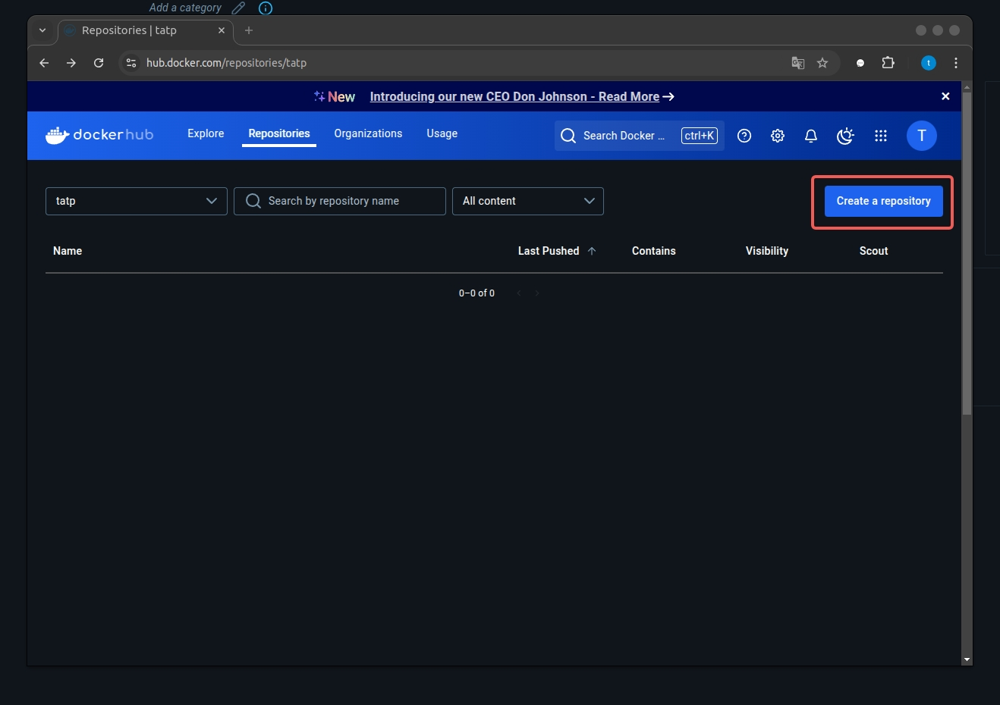

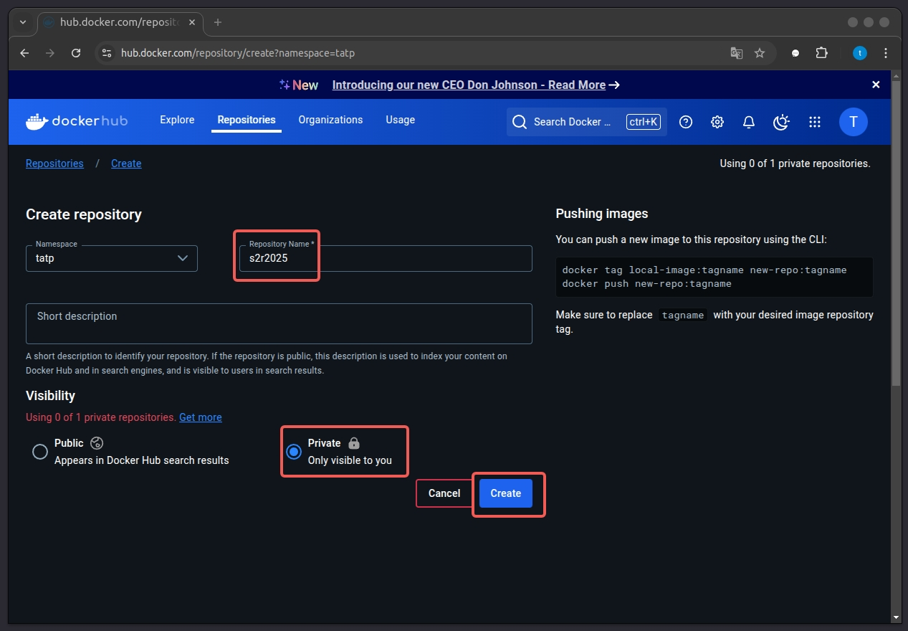

### 2. 将client镜像push到private repo

将client镜像打上tag(tag名称，参赛队伍可以自定义)，dockerhub_name为dcokerhub的账号名字
```
docker tag s2r2025/client:v1.0 dockerhub_name/s2r2025:example_tag
```
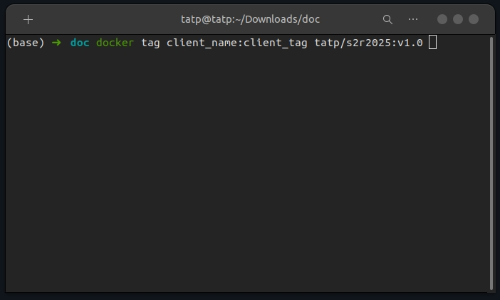

将新tag的client镜像push到private repo
```
docker push dockerhub_name/s2r2025:example_tag
```

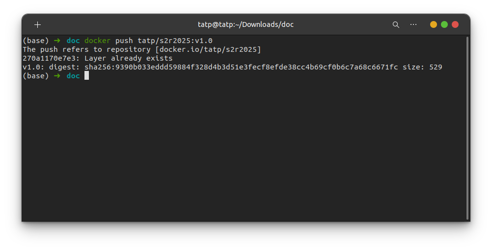

### 3. 开发比赛任务

根据private repo和tag名字，修改create_containner_client.sh里的镜像名和tag

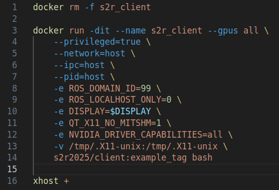

运行create_client.sh，创建新容器。

运行exec_client.sh脚本，进入客户端镜像终端开始进行开发工作。

强烈推荐使用 Git 工具进行代码版本管理，以确保代码的安全性和可追溯性。

在 Docker 环境中，您也可以通过 Visual Studio Code（VS Code）安装docker插件 进行高效开发。

### 4. docker commit

本地保存镜像修改内容，使用原有的tag会覆盖之前tag版本的内容
```
docker commit s2r2025_client dockerhub_name/s2r2025:new_tag
```

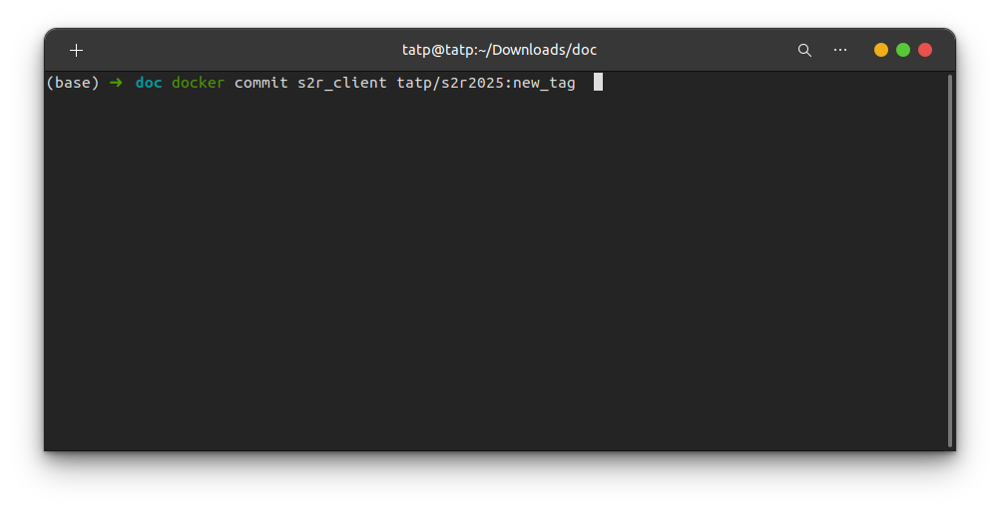

### 5. docker push

通过docker push到private repo保存当前docker镜像到dockerhub
```
docker push dockerhub_name/s2r2025:example_tag
```

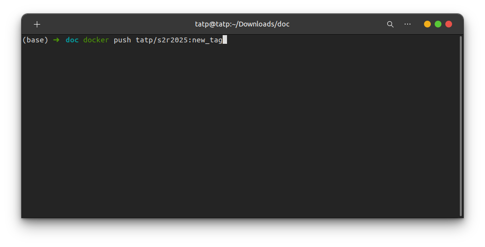

### 6. 生成访问token

参考连接：[docker token](https://docs.docker.com/docker-hub/access-tokens/)

在需要提交测试的版本时，将dockerhub用户名、docker token由比赛系统提交。

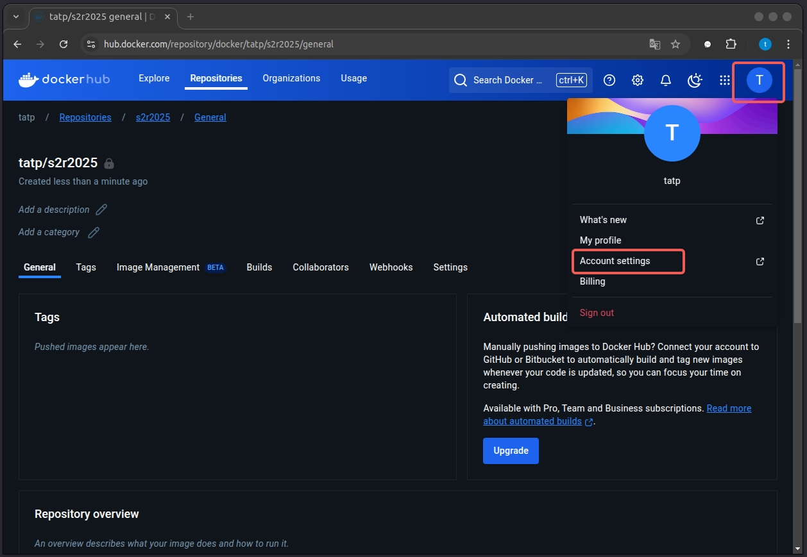

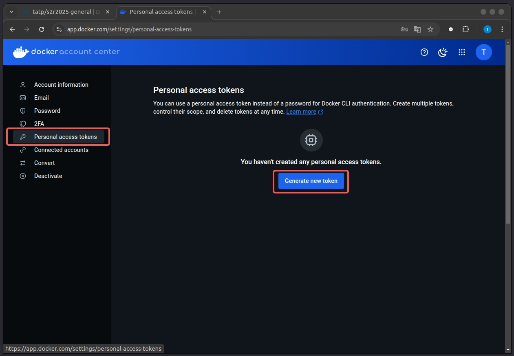

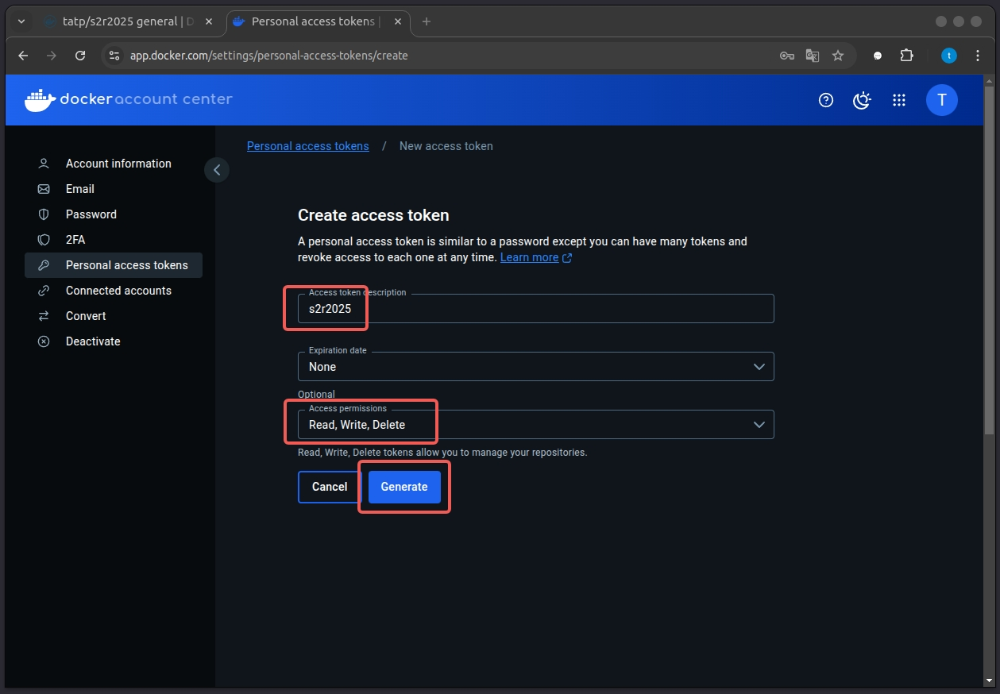

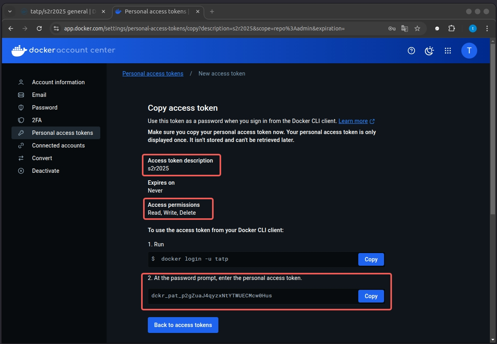
